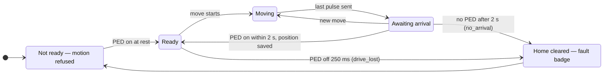

# Drive feedback — iHSS60 PED / ALM supervision

How the tuner controller uses the two feedback outputs of the JMC iHSS60
closed-loop drives to notice a motor that did not move as commanded: why
the feature exists, how to wire it to the V2.09 carrier, how to
commission it safely, what the firmware does, and how to recover from a
fault.

**Status (2026-09-13):** firmware in `main` (PR #24) and running on the
bench controller. **Supervision is off by default** and stays off until
the operator enables it after the wiring is done. The bench drives are
not wired yet.

Related: [PROTOCOL.md](PROTOCOL.md) "Drive feedback" (HTTP interface),
[HW-T41-PINMAP.md](HW-T41-PINMAP.md) §2.2 (pin allocation),
[../CLAUDE.md](../CLAUDE.md) invariants 3 and 7,
[iHSS60 manual V1.1](https://www.rocketronics.de/download/datasheet/iHSS/iHSS60_EnglishManual.pdf).

---

## 1 · Why it exists

The controller knows an element's position only by counting the step
pulses it sends. The iHSS60 closes its position loop inside the drive, so
the count equals the shaft position only while the drive actually follows
the pulses.

That assumption failed on the bench on 2026-09-13. The motor supply was
switched off during **Run to home end** while the Teensy stayed powered
from its own 5 V. The controller kept sending pulses to a dead drive,
counted them all, reported C1 at home and saved that as a clean anchor.
The shaft had stopped part-way. A later move to "max" could have driven
the vacuum capacitor far past its mechanical stop.

The drive's only machine-readable feedback is two opto outputs, PED and
ALM. Supervising them lets the firmware refuse to trust a count the drive
did not confirm.

## 2 · The two signals

Both outputs are **opto transistors lit by the drive's own electronics**
(manual §3.1). When the drive has no supply, the transistor is open,
whatever the parameters say.

| Output | Meaning | Factory setting (no HISU tool needed) | Drive unpowered reads as | Catches |
|---|---|---|---|---|
| **PED** (arrive position) | Encoder agrees with the commanded position | P14 = 1: conducts when arrived | **"not arrived"** | Motor-power loss, stall, jam, cable break |
| **ALM** (alarm) | Drive fault | P10 = 0: conducts on fault | "no alarm" | Over-current, over-voltage, following error |

With the factory settings, **PED is the signal that sees a loss of motor
power**; ALM does not. ALM becomes fail-safe only with P10 = 1, which
needs JMC's HISU tool (see §3.4).

The drive's red LED identifies an alarm by its flash count (manual §7):

| Flashes | Fault |
|---|---|
| 1 | Coil current above the drive's limit (over-current) |
| 2 | Voltage reference error |
| 3 | Parameter upload error |
| 4 | Input voltage above the limit (over-voltage, 80 V) |
| 5 | Following error above the position error limit (P16) |

The manual lists **no under-voltage alarm**. The drive is rated for
**24–50 VDC** (36 V typical); how PED and ALM behave on a sagging or
12 V supply is not documented.

## 3 · Wiring

### 3.1 Connections

Each output wires straight to a carrier opto input: **+ → Sig, − → Gnd**.
No resistors are needed; the carrier input replaces the 3–5 kΩ pull-up
the manual shows.

| Drive signal | Carrier terminal | Teensy pin |
|---|---|---|
| PED, motor 0 (X) | Lim A | 23 |
| PED, motor 1 (Y) | Lim B | 28 |
| PED, motor 2 (Z) | Probe | 15 |
| ALM of **every** drive, in parallel | Door | 29 |

```
iHSS60, motor 0 (X)                   V2.09 carrier
  PED+ ──────────────────────────────  Lim A  Sig   (pin 23)
  PED− ──────────────────────────────  Lim A  Gnd

iHSS60, motors 0 / 1 / 2              V2.09 carrier
  ALM+ (all three joined) ───────────  Door   Sig   (pin 29)
  ALM− (all three joined) ───────────  Door   Gnd
```

- **Motors 1 and 2** wire their PED the same way to Lim B and Probe.
- **Only motors bound in the topology are supervised.** A Balanced L
  install uses motors 0 and 1; the spare motor 2 needs no PED wire.
- **Displaced functions:** pin 15 was the RF-presence spare and pin 29
  the enclosure interlock. The lead-screw limit inputs (pins 20/21/22)
  are unchanged.

### 3.2 Electrical notes

- **Carrier input circuit:** board 5 V → 330 Ω → EL357N LED → Sig. The
  input is asserted by sinking about 11 mA from Sig to Gnd; the Teensy
  pin then reads LOW. Response time is 50–100 µs.
- **Current through the drive's transistor:** about 10 mA. The manual
  gives no output current rating; confirm the input switches cleanly
  during commissioning (§4, step 3).
- **Isolation:** the drive's opto output isolates the carrier from the
  motor supply, so tying ALM− / PED− to carrier ground creates no ground
  loop.
- **Parallel ALM:** with P10 = 0, any faulted drive pulls the shared input
  low. The firmware cannot tell which drive alarmed.

### 3.3 Supply

Run the drives from **24–50 V** before trusting the feedback. The bench
currently uses 12 V for initial testing, which is outside the rating.

### 3.4 If P10 is ever set to 1

With a HISU tool, P10 = 1 makes ALM conduct while healthy, so a power loss
or broken cable reads as an alarm immediately, even mid-move. The wiring
and firmware must then change together:

- wire the ALM transistors **in series** (all healthy = input low) instead
  of in parallel — two in series are comfortable, three are marginal for
  the carrier's LED current;
- set `ALM_ACTIVE_LOW = false` in
  `firmware/tuner-controller/src/hal/board/t41_v209.h` and rebuild.

## 4 · Commissioning

Do this once, after wiring, with the network in **bypass** and no RF.
Nothing here needs the tuner connected to the antenna.

1. **Power off and wire** per §3.1. Power the drives from 24–50 V.
2. **Open the browser page.** The *Drive feedback (iHSS60 PED / ALM)*
   panel shows "PED arrival supervision **off**" and "ALM alarm
   supervision **off**". The `live inputs` line shows every motor's PED
   and the ALM level even while supervision is off.
3. **Check the levels at rest.** Every bound motor must read **PED
   arrived**, and ALM must read **clear**. If not, stop and see §8.
4. **Watch a move.** Jog a motor by +1 rev. Its card shows PED go **off**
   while turning and back to **arrived** when it stops.
5. **Enable PED.** Press *Enable* next to PED and confirm. The setting
   is saved immediately.
6. **Test a power loss at rest.** Switch the motor supply off. Within
   about a quarter of a second each bound motor card shows **DRIVE LOST
   (PED OFF) — HOME CLEARED, RE-HOME**. Switch the supply back on and
   re-home every element (§6).
7. **Test a power loss during a move.** Start a long move (e.g. +5 rev)
   and switch the motor supply off part-way. The pulse count still runs
   to the end; within 2 s after it the moving motor's card shows **DRIVE
   DID NOT ARRIVE — HOME CLEARED, RE-HOME**. The idle motors lose their
   supply too and show **DRIVE LOST**. Restore the supply and re-home
   every element.
8. **Enable ALM**, then test it without faulting a drive by connecting
   the Door input's **Sig to Gnd** during a move (this is exactly how the
   input is asserted, so it is safe). Every motor stops at once, and —
   since any hand-made contact lasts longer than 20 ms — every element
   shows **DRIVE ALARM — HOME CLEARED, RE-HOME**, with motion refused
   until the contact is released. Re-home every element afterwards.

After step 8 the feature is commissioned. Both settings survive power
cycles and firmware updates.

## 5 · What the firmware does

### 5.1 PED — per bound motor, when enabled

| Event | Result |
|---|---|
| A move ends and PED reports arrival within **2 s** | Position saved as a clean anchor |
| A move ends and PED does **not** report arrival within 2 s | Element's home cleared — fault `no_arrival` |
| PED off for **250 ms** at rest, after the drive had reported ready | Element's home cleared — fault `drive_lost` |
| PED off at rest (any time) | Motion verbs refused with `drive_not_ready` |
| Controller boots with motor power off | Home kept (the controller cannot tell how long power was off); motion refused until PED comes on |
| Driver switched off with *Driver off* | Not supervised while off; if switched off while a move awaits arrival, home is cleared unless PED reports arrival at that moment |



- **While a move awaits arrival**, a quick follow-up command (another
  click) is accepted; the wait simply restarts when that move ends.
- **A move awaiting arrival still counts as motion in progress.** Changing
  the topology or the feedback settings, and uploading or applying
  firmware, are refused with `moving` until arrival is confirmed or the
  2 s timeout clears home.

### 5.2 ALM — all drives, when enabled

| Event | Result |
|---|---|
| First sample of an active ALM | Pulses cut on **every** motor at once (no deceleration ramp) |
| ALM still active after **20 ms** | Home cleared on **every** bound element — fault `alarm` (the parallel wiring cannot identify the drive) |
| ALM active | Motion verbs refused with `drive_alarm` |
| ALM glitch shorter than 20 ms | Moves stopped, homes kept |

### 5.3 Faults

- **The first cause is kept.** An alarm also stops the drive arriving;
  the element shows `alarm`, not the `no_arrival` that follows.
- **A fault badge stays until home is set again** on that element.
- **After a reboot** the badge is gone (faults are not stored), but the
  cleared home **is** stored, so the element stays unanchored.
- **The master link sees the same refusals** (`drive_alarm`,
  `drive_not_ready`) on its motion verbs, and `homed` goes false in its
  `state` frame.

## 6 · Faults and recovery

| Motor card shows | Meaning | What to do |
|---|---|---|
| **DRIVE DID NOT ARRIVE — HOME CLEARED, RE-HOME** | A move ended and the drive never confirmed arrival: stall, jam, motor power lost, or a drive fault | Check the drive's red LED and the motor supply, then re-home |
| **DRIVE LOST (PED OFF) — HOME CLEARED, RE-HOME** | PED dropped at rest: motor power lost, cable disconnected, or the shaft was forced off position | Restore power / cable, then re-home |
| **DRIVE ALARM — HOME CLEARED, RE-HOME** | ALM active for 20 ms or more on some drive | Count the red LED flashes (§2), fix the cause, power-cycle the drive if it latches, then re-home every element |

**Re-homing an element:**

1. Fix the cause. The card's PED readout must show **arrived** again, and
   ALM must read clear; until then motion is refused.
2. Make sure the network is in **bypass**. An element without home can be
   jogged only in bypass.
3. Jog the element onto its physical home position, a few steps inside
   the stop.
4. Press **Set current pos as home**. The fault badge clears and the
   element is anchored again.

## 7 · Settings, persistence and API

### 7.1 Enabling and disabling

- **Browser page:** *Enable* / *Disable* buttons for each signal in the
  Drive feedback panel. Enabling asks for confirmation.
- **HTTP:** `GET /api/feedback?ped=1&alm=0` (either parameter may be
  left out). The reply is `drive feedback saved: PED on, ALM off`.
- **Refusal:** `409 moving` while any motor runs or a move awaits
  arrival. Without parameters the reply is `400 give ped=0|1 and/or
  alm=0|1`.

### 7.2 Where the setting is stored

| Store | Form | Notes |
|---|---|---|
| EEPROM (`hal::nvs`) | Byte 5 = `0xA0` \| bit 0 PED \| bit 1 ALM | Any other value — including erased `0xFF` from firmware older than the feature — means both off. The EEPROM layout version was **not** changed, so flashing an older build never invalidates the record or its position anchors. |
| SD card `/tuner/config.json` | `"feedback": { "ped": false, "alm": false }` | A file without the key reads as both off. The usual rule applies at boot: the card wins if its `generation` is not older than EEPROM's. |

### 7.3 Status fields (`GET /api/status`)

| Field | Meaning |
|---|---|
| `feedback.ped`, `feedback.alm` | Supervision enabled |
| `feedback.alarm` | Live ALM input level (reported even while disabled) |
| `axes[].ped` | Live PED input level for that motor (reported even while disabled) |
| `axes[].drive_fault` | `""`, `no_arrival`, `drive_lost` or `alarm` |

### 7.4 Timing constants

In `firmware/tuner-controller/src/app/motion.cpp`:

| Constant | Value | Purpose |
|---|---|---|
| `kArrivalTimeoutMs` | 2000 ms | PED must confirm a finished move within this |
| `kDriveLostMs` | 250 ms | PED off this long at rest means the drive is lost |
| `kAlarmConfirmMs` | 20 ms | ALM held this long clears home (pulses stop on the first sample) |

## 8 · Troubleshooting

| Symptom (supervision off, at rest) | Likely cause |
|---|---|
| PED reads **off** on a wired motor | Drive unpowered or under-voltage (red LED on); PED+ and PED− swapped; wired to the wrong input; P14 changed from its default |
| PED reads **arrived** on an unwired motor | A short between that input's Sig and Gnd |
| ALM reads **ACTIVE** | A drive in fault (count the red LED flashes); a short between Door Sig and Gnd |

| Symptom (supervision on) | Likely cause |
|---|---|
| **Every move** clears home | PED not wired or reversed. Press *Disable* next to PED and repeat §4 step 3 |
| Moves sometimes end in **DRIVE DID NOT ARRIVE** | Following error on a heavy load: lower speed or acceleration; supply too weak (12 V); check the red LED for code 5 |
| Motion refused with `drive_not_ready` although the motor is fine | PED input level dropped (cable, connector); motor supply off |
| Changing topology or feedback refused with `moving` right after a move | Normal: the move is still awaiting arrival — wait up to 2 s |

## 9 · Limits

- **A power loss during a move is detected when the move's pulses end**,
  not at once: PED is normally off while the motor turns. Only ALM with
  P10 = 1 (HISU tool) would stop the pulses immediately.
- **ALM at the factory P10 = 0 is blind** to a loss of motor power and to
  a broken ALM cable.
- **Parallel ALM cannot identify the drive**, so an alarm clears home on
  every element.
- **PED behaviour during slow motion is not documented** by JMC; §4 step 4
  shows it on the bench.
- **12 V operation is outside the drive's rating**, and its effect on the
  signals is unknown.
- **The feedback setting is HTTP-only.** The master link has no verb for
  it, and its `state` frame does not carry the PED/ALM fields.
- **Drive feedback does not replace the limit switches** (invariant 7).
  Direction-latched limit-switch handling is still to be implemented.

## 10 · For developers

| Piece | Where |
|---|---|
| HAL interface `hal::feedback` (`arrived(axis)`, `alarm()`) | `src/hal/hal.h` |
| Teensy backend (opto inputs, `INPUT_PULLUP`) | `src/hal/feedback_teensy41.cpp` |
| Sim backend + test hooks (`sim_set_powered`, `sim_set_stalled`, `sim_set_alarm`, `sim_reset`) | `src/hal/feedback_sim.cpp` |
| Pins and polarity (`FEEDBACK_PED`, `FEEDBACK_ALM`, `PED_ACTIVE_LOW`, `ALM_ACTIVE_LOW`) | `src/hal/board/t41_v209.h` |
| Supervision (`supervise_alarm`, `supervise_ped`, `drop_anchor`, `refuse_if_drive_fault`, `set_feedback`, `any_motion_pending`) | `src/app/motion.cpp` |
| EEPROM byte, JSON codec | `src/app/config.cpp`, `src/app/settings.cpp` |
| HTTP verb and status fields; browser panel | `src/http_server.cpp`, `src/web_page.h` |
| Tests | `test/test_feedback_native` (13), plus `test_config`, `test_settings`, `test_ota` |

Paths are relative to `firmware/tuner-controller/`. Rules for changes:

- **Keep supervision off by default.** An unwired PED would clear every
  home.
- **Anything that needs the tuner at rest** (a setting change, a firmware
  update) must use `app::motion::any_motion_pending()`, not
  `hal::motor::busy()` — a finished move awaiting arrival has not been
  recorded yet.
- **Do not bump the EEPROM layout version** to add a setting. Older
  firmware would reset the record, and the card would then restore
  `home_set` over zeroed positions. Use a self-marking value in a free
  byte instead.
